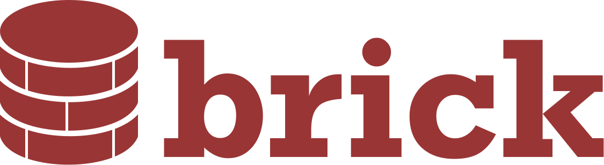

An intuitive way to work with persistent data in Dart.

## What is Brick?

Brick is an extensible query generator for Dart applications. It's an all-in-one solution responsible for representing business data in the application, regardless of where your data comes from. Using Brick, developers can focus on implementing the application, without concern for where the data lives. Brick was inspired by the need for applications to work offline first, even if an API represents your source of truth.

Brick is inspired by [ActiveRecord](https://guides.rubyonrails.org/active_record_basics.html), [Ecto](https://hexdocs.pm/ecto/), and similar libraries.

## Why Brick?

* Handles and hides all complex serialization/deserialization logic between any external source(s)
* Single access point and opinionated DSL establishes consistency when pushing and pulling data across your app
* Automatic, [intelligently-generated migrations](packages/brick_sqlite)
* Legible querying interface

## When should I not use Brick?

* When data doesn't persist between sessions
* When large datasets are frequently used (images, document storage, etc.)
* When key-value data is stored (instead consider [localstorage](https://pub.dev/packages/localstorage))

## Usage

Create a model as the app's business logic:

```dart
// app/models/user.dart
@ConnectOfflineFirstWithRest()
class User extends OfflineFirstWithRestModel {}
```

And generate (de)serializing code to fetch to and from multiple providers:

```shell
$ (flutter) pub run build_runner build
```

### Fetching Data

A repository fetches and returns data across multiple providers. It's the single access point for data in your app:

```dart
class MyRepository extends OfflineFirstWithRestRepository {
  MyRepository();
}

final repository = MyRepository();

// Now the models can be queried:
final users = await repository.get<User>();
```

Behind the scenes, this repository could poll a memory cache, then SQLite, then a REST API. The repository intelligently determines how and when to use each of the providers to return the fastest, most reliable data.

```dart
// Queries can be general:
final query = Query(where: [Where('lastName', 'Muster', compare: Compare.contains)]);
final users = await repository.get<User>(query: query);

// Or specific:
final query = Query.where('email', 'user@example.com', limit1: true);
final user = await repository.get<User>(query: query);
```

### Mutating Data

Once a model has been created, it's sent to the repository and back out to _each_ provider:

```dart
final user = User();
await repository.upsert<User>(user);
```

### Associating Data

Repositories can support associations and automatic (de)serialization of child models.

```dart
class Hat extends OfflineFirstWithRestModel {
  final String color;
  Hat({this.color});
}
class User extends OfflineFirstWithRestModel {
  // user has many hats
  final List<Hat> hats;
}

final query = Query.where('hats', Where('color', 'brown'));
final usersWithBrownHats = repository.get<User>(query: query);
```

Brick natively [serializes primitives, associations, and more](packages/brick_offline_first/example/lib/app/models/kitchen_sink.dart).

# Table of Contents

- [Setup](#setup)
- [Glossary](#glossary)
- [Models](#models)
  * [Setup](#setup-1)
  * [Serialized Fields](#serialized-fields)
  * [Annotations](#annotations)
  * [Custom Generators](#custom-generators)
    - [Placeholders](#placeholders)
  * [FAQ](#faq)
- [Query](#query)
  * [where:](#where)
    - [Associations](#associations)
    - [compare:](#compare)
    - [required:](#required)
  * [Filtering](#filtering)
    - [Where.byField](#wherebyfield)
    - [Where.firstByField](#wherefirstbyfield)
- [Providers](#providers)
  * [Fetching and Mutating Data](#fetching-and-mutating-data)
  * [Query](#query-1)
    - [params:](#params)
    - [where:](#where-1)
  * [Translation and the Model Dictionary](#translation-and-the-model-dictionary)
  * [Class-level Configuration](#class-level-configuration)
  * [Field-level Configuration](#field-level-configuration)
- [Repository](#repository)
  * [Setup](#setup-2)
    - [Access](#access)
  * [Creating a Custom Repository](#creating-a-custom-repository)
    - [Methods](#methods)
      * [Applying Query#action](#applying-queryaction)
    - [Class-level Configuration](#class-level-configuration-1)
    - [Field-level Configuration](#field-level-configuration-1)
  * [FAQ](#faq-1)
- [Providers and Repositories](#providers-and-repositories)
- [General FAQ](#general-faq)

# Setup

1. Add the packages:
    ```yaml
    dependencies:
      brick_offline_first: any
    dev_dependencies:
      brick_build: any
      build_runner: any
    ```
1. Ignore generated files in `.gitignore`. It is recommended to **not** commit files appended with `.g.dart` to version control. Instead, these files should be built on every `pull` as well as on every build in a CI/CD pipeline. This ensures your code is generated with the most recent version of Brick and remains untouchable by contributors.
    ```
    *.g.dart
    # alternately, uncomment the lines below to only target brick files
    # app/adapters/*.dart
    # app/db/*.g.dart
    # app/brick.g.dart
    ```
1. Generate files on every significant change. While not required, it is recommend to add the following to `.git/hooks/post-checkout`:
    ```shell
    # .git/post-checkout
    #!/bin/sh

    cd `dirname "$0"`
    cd ../../
    flutter pub get
    flutter pub run build_runner build
    ```
1. Configure your app directory structure to match Brick's expectations:
    ```shell
    mkdir -p lib/app/adapters lib/app/db lib/app/models;
    ```

    Models **must be** saved in `lib/app/models/<class_as_snake_name>.dart`.

1. Extend [an existing repository](#providers-and-repositories) or create your own:
    ```dart
    // lib/app/repository.dart
    class MyRepository extends OfflineFirstWithRestRepository {}
    ```

# Glossary

* [**Provider**](#providers) - Fetches from and pushes to a data source.
* [**Repository**](#repository) - Manages `Provider`(s) as middleware between the app logic and the `Provider` logic.
* **Adapter** - Normalizizes data input and output between `Provider`s. Almost always generated.
* [**Model**](#models) - Business logic unique to the app. Can be queried by the `Repository`, and if merited by the `Repository` implementation, the `Provider`.
* **ModelDictionary** - Connects a `Provider` to the `Model`'s `Adapter`. Almost always generated.
* **field** - Single, accessible property of a model. For example, `final String id`.
* **deserialize** - convert raw data _from_ a provider.
* **serialize** - convert a model instance _to_ raw data for a provider.
* **source** - external information warehouse that delivers unrefined or raw data

# Models

## Setup

Every model must be decorated by an annotation and extend a base type that the repository manages:

```dart
@ConnectOfflineFirstWithRest()
class User extends OfflineFirstModel {}
```

The primary constructor of the model **must** include named arguments for all serialized fields. Brick **does not support** unnamed constructor arguments. This is an opinionated choice that enables the adapters to reliably return a hydrated model. The constructor may elect to mutate input data, but the named arguments **must be present**:

```dart
class Hat extends OfflineFirstModel {
  final String color;
  final int width;

  Hat({
    this.color,
    int width,
  }) : width = (width ?? 0) + 1;
}
```

:bulb: Every `import` in a model definition file will be copied to `brick.g.dart` and available to the adapters. This is useful for field-level generators or class-level annotations that stringified functions (`RestSerializable#endpoint`).

## Serialized Fields

All `final` fields of a model, unless specified, will be (de)serialized by the provider. Computed getters (`int get number => 5 + 10`) are not deserialized _from_ providers. However, they are serialized to, allowing generation of custom fields to send to an API or to query cached results in SQLite (to skip, declare `ignore: true` in the field's annotation). Setters are never serialized.

### Annotations

As providers are ultimately responsible for converting raw data into model data, a description of fields on models is overly generic. Field-level annotations always override class-level annotations/configuration. However, providers should adhere to some standards of annotations:

| Named Arg | Description | Example |
|---|---|---|
| `ignore:` | Do not deserialize (from) or serialize (to) this field to a provider | `@Rest(ignore: true)` |
| `name:` | Stored key for this field according to the provider. In SQLite, for example, this would be the column name. | `@Sqlite(name: "address_2")` |
| `defaultValue:` | Value to use in absence or `null` of the instance. This is only applied on transmission to and from the provider; it does not dictate what the Dart model will hold on empty instantiation. Note that while the annotation accepts a `dynamic` type, the accepted primitives vary by provider. | `@Rest(defaultValue: 1)` |
| `nullable:` | `null` fields are handled gracefully when serializing and deserializing. | `@Rest(nullable: true)` |
| `fromGenerator` | A stringified function with access to [placeholders](#placeholders); replaces adapter's generated deserialize code for the field. Do not include trailing semicolons or function body wrapping symbols (`{}` or `=>`) in the definition. | `@Rest(fromGenerator: "int.tryParse(%DATA_PROPERTY%.toString())")` |
| `toGenerator` | A stringified function with access to [placeholders](#placeholders); replaces adapter's generated serialize code for the field. Do not include trailing semicolons or function body wrapping symbols (`{}` or `=>`) in the definition. | `@Sqlite(toGenerator: "%INSTANCE_PROPERTY% > 1 ? 1 : 0")` |

### Custom Generators

For non-standard input, consider writing a custom (de)serializer. Use caution as this will **completely replace** inferred type serializations. These are available at field-level as arguments.

Since Dart requires annotations to be constants, `Function`s must be stringified.

```dart
// given
final data = {
  'outfit': {
    'hat': 0,
    'shoe': 1,
    'shirt': 1,
  },
};

// a simple generator for the field `final Map<Clothes, Condition> clothesMap`
"""(data['outfit'] as Map<String, dynamic>).map((key, value) {
  return MapEntry(
    Clothes.keys.firstWhere((v) => v.toString().split('.').last == value),
    Condition.values[value]
  );
})""";
```

#### Placeholders

To replace a few parts and DRY up code in custom, field-level generators, placeholders can be employed and replaced with values at build time.

All custom generators passed through field annotations (such as  `@Rest(fromGenerator:)` or `@Sqlite(toGenerator:)`) have access to predefined placeholders and custom placeholders.

To declare your own variables, wrap the variable name like a tag using `@`: `@VARIABLE_NAME@value@/VARIABLE_NAME@`. Placeholders and their values **must** conform to the RegEx `[\w\d]+`.

```dart
// Important parts are swapped out for placeholders:
final customGenerator = """(%DATA_PROPERTY% as Map<String, dynamic>).map((key, value) {
  return MapEntry(
    %ENUM%.keys.firstWhere((v) => v.toString().split('.').last == value),
    Condition.values[value]
  );
})""";

// And variable values are assigned:
@Rest(
  fromGenerator: "$customGenerator@ENUM@Clothes@/ENUM@",
);
```

There are several globally-defined placeholders:

* `%ANNOTATED_NAME%` - key name.
    ```dart
    @Rest(name: 'my_field')
    final String myField
    // => 'my_field'
    ```
* `%DATA_PROPERTY%` - deserializing key name (`@Rest(name:)` or `@Sqlite(name:)` or the default) wrapped in the deserialized map. **Only use in `fromGenerator`**.
    ```dart
    @Rest(name: 'my_field')
    final String myField
    // => data['my_field']
    ```
* `%INSTANCE_PROPERTY%` - serializing property. **Only use in `toGenerator`**.
    ```dart
    @Rest(name: 'my_field')
    final String myField
    // => instance.myField
    ```

## FAQ

### Why are annotations AND extensions required?

The annotation is required to build the generated files (adapters, migrations, etc.). The type extension (e.g. `OfflineFirstModel`) is used by the repository's type system.

# Query

Filter local data using `Query`. Providers will use the `Query` to translate requested data into their query language. For the universality and legibility of SQL, that provider's translations will be used in the following examples but it is not the de facto query language of all providers.

## `where:`

When using `Query`, use the field name to find pertinent data instead of the column name. For example:

```dart
class User extends OfflineFirstModel {
  final SqliteAssociation association;
  @Sqlite(name: 'name')
  final String lastName;
}

// A query for all users with the last name "Mustermann":
Query.where('lastName', 'Mustermann') // note this is lastName and not name or last_name
```

Querying can be done with `Where` or `WherePhrase`:

1) `WherePhrase` is a collection of `Where` statements.
2) `WherePhrase` can't contain mixed `required:` because this will output invalid SQL. For example, when it's mixed: `WHERE id = 2 AND name = 'Thomas' OR name = 'Guy'`. The OR needs to be its own phrase: `WHERE (id = 2 AND name = 'Thomas') OR (name = 'Guy')`.
3) `WherePhrase` can be intermixed with `Where`.
      ```dart
      [
        Where('id', 2),
        WherePhrase([
          Where('name', 'Guy', required: false),
          Where('name', 'Thomas', required: false)
        ], required: false)
      ]
      // => (id == 2) || (name == 'Thomas' || name == 'Guy')
      ```

:warning: Queried enum values should map to a primitive. Plainly, **always include `.index`**: `Where('type', MyEnumType.value.index)`.

### Associations

Params are forwarded to the provider which chooses to accept or reject specific keys. For example, Rest accepts the `headers` key to control request headers. SQLite supports operators like `groupBy`, `orderBy`, `offset`, and others in its params.

When querying associations, use a nested `Where`, again searching by field name on the association. For example:

```dart
Query(where: [
  Where(
    'association',
    Where('name', 'Thomas'),
  )])
```

### `compare:`

Fields can be compared to their values beyond an exact match (the default).

```dart
Where('name', 'Thomas', compare: Compare.contains);
```

* `between`
* `contains`
* `exact`
* `greaterThan`
* `greaterThanOrEqualTo`
* `lessThan`
* `lessThanOrEqualTo`
* `notEqual`

Please note that the provider is ultimately responsible for supporting `Where` queries.

### `required:`

Conditions that are required must evaluate to true for the query to satisfy. They can be specified individually:

```dart
Query(where: [
  Where('name', 'Thomas', required: true),
  Where('age', 42, required: true),
])
// => name == 'Thomas' && age == 42
```

Or specified as a whole phrase:

```dart
Query(where: [
  WherePhrase([
    Where('name', 'Thomas', required: true),
    Where('age', 42, required: true),
  ], required: true),
  WherePhrase([
    Where('height', 182),
    Where('country', 'France'),
  ], required: true)
])
// =>  (name == 'Thomas' && age == 42) && (height == 182 || country == 'France')
```

If expanded `WherePhrase`s become unlegible, helpers `And` and `Or` can be used:

```dart
Query(where: [
  And('name', 'Thomas'),
  And('age', 42),
])
```

## Filtering

In the provider (or even a REST endpoint), convenience methods are available to quickly interpret a query.

### `Where.byField`

Find conditions that evaluate a specific field. A field is a member on a model, such as `myUserId` in `final String myUserId`. If the use case for the field only requires one result, say `id` or `primaryKey`, `Where.firstByField` may be more useful.

```dart
Where.byField('lastName', query.where);
```

### `Where.firstByField`

Find the first occurrance of a condition that evaluates a specific field. This is useful when querying for a unique record. For all conditions, use `Where.byField`.

```dart
final condition = Where.firstByField('id', query.where);
final id = condition?.value;
```

# Providers

Providers deliver data from a single source as a model. For example, a provider could fetch from Firebase. Or from a SQL database.

A provider is **only accessed from the repository**. Invoking the provider from the application is strongly discouraged; if a custom method or extension is required, the repository should be customized instead of the provider.

## Fetching and Mutating Data

A provider fetches, inserts, updates, and deletes. Methods only handle one model or instance at a time. These methods should hold minimal amounts of logic and be narrowly focused. If providers require a substantial translation layer (for example, transforming a `WherePhrase` into SQL), the translation layer should be done by a separate class and delivered cleanly to the caller.

```dart
// the only type argument describes the expected return result
// and how the method should deserialize the data
Future<_Model> get<_Model extends RestModel>({Query query}) async {
  // the transforming logic can be tested separately as a separate class
  final queryAsSql = QuerySqlTransformer(query).asSql;
}
```

For methods that mutate data, the first unnamed argument should be an instance of the model with a named argument for `Query`:

```dart
Future<_Model> upsert<_Model extends RestModel>(RestModel instance, {Query query}) async {}
```

Underscore prefixing of type declarations ensure that 1) they will likely not conflict with another class 2) they signal closed, non-exported use. This convention is not required in custom implementations but is recommended for consistency.

## Query

Every public instance method should support a named argument of `{Query query}`. `Query` is the glue between an application and an abstracted provider or repository. It is accessed by both the repository and the provider, but as the last mile, the provider should interpret the `Query` at its barest level.

### `params:`

`params` describe how to interact with a provider's source.

```dart
params: {
  // limit describes how many results the provider requires from the source
  'limit': 10,
},
```

As `params` can vary from provider to provider and IDE suggestions are unavailable to a string-key map, `params` should be clearly and accessibly documented within every new provider.

### `where:`

`where` queries with a model's properties. A provider may optionally support `where` arguments. For example, while a SQLite provider will always support column querying, a RESTful API will likely be less consistent and may require massaging the field name:

```dart
[Where('firstName', 'Thomas'), Where('age', 42)];
// SQLite => SELECT * FROM Users WHERE first_name = "Thomas" AND age = 42;
// REST => https://api.com/users?by_first_name=Thomas&age=42
```

The translation from model field name (e.g. `firstName`) to serializer field name (e.g. `first_name`) may occur in the adapter or in a class-level configuration (e.g. `RestSerializable#endpoint`). However, it should always be accessed by the provider from the adapter.

## Translation and the Model Dictionary

After the provider receives raw data from its source, it must be built into a model or a list of models. This translation occurs in the adapter. First, the adapter is discovered via the model dictionary, a simple hash table that connects models with adapters

```dart
Future<_Model> get<_Model extends RestModel>({Query query}) async {
  // Connects to _ModelAdapter
  final adapter = modelDictionary.forAdapter[_Model];
  final resp = ... // fetch from HTTP

  // Now the provider can (de)serialize
  return response.map((r) => adapter.fromRest(r));
}
```

The adapter can also facilitate deserialization in the provider with other information about the class:

```dart
class UserAdapter {
  // class-level configurations can be copied to the adapter
  final String fromKey = "users";

  // translate field names (provided by Query#where) to their SQLite column names
  final fieldsToSqliteColumns = {
    "primaryKey": {
      "name": "_brick_id",
      "type": int,
      // some information about the type is no longer available after build
      // because this requires mirrors, however, it can be preserved in the adapter
      "iterable": false,
      "association": false,
    },
  };
}
```

Adapters - made up of both serdes code and custom translation maps such as `fieldsToSqliteColumns` or `restEndpoint` - are generated in [brick_build](brick_build).

## Class-level Configuration

While models should never be aware of providers, a provider's configuration may be required by a repository. As this is accessed via an annotation, configurations **must be `const`**. Class-level configuration is useful for setting defaults, describing behavior that relies on an instance,

```dart
RestSerializable(
  fieldName: FieldRename.pascal,
  nullable: true,
)
```

Configuration can also describe behavior that relies on an instance. Since functions cannot be passed in a `const` class, a stringified function body can be used:

```dart
RestSerializable(
  // implied arguments are instance and query
  endpoint: r"=> query.action == QueryAction.get ? '/users' : '/users/${instance.id}'",
)
```

It is **not recommended** to require the end implemenation declare arguments for stringified functions. If the provider's arguments for the property changes, the Dart type system will not detect the error ahead of run time.

:warning: If the provider conflicts with usage of `dart:mirrors`, the configuration should be hosted in an independent package. For example, `brick_sqlite` and `brick_sqlite_abstract`.

## Field-level Configuration

A provider may choose to implement configuration at the field-level with annotations. These annotations should implement `FieldSerializable`:

```dart
@Rest(ignore: true, name: "e-mail")
@Sqlite(unique: true)
final String email;
```

:bulb: Keep annotations as atomic as possible. A provider annotation is not reliable to another provider.

# Repository

A repository routes application data to and from one or many providers. Repositories should only hold repository-specific logic and not pass interpreted data to its providers (e.g. the repository does not transform a `Query` into a SQL statement for its SQLite provider).

## Setup

End-implementation uses (e.g. a Flutter application) should `extend` an abstract repository and pass arguments to `super`. If custom methods need to be added, they can be written in the application-specific repository and not the abstract one. Application-specific `brick.g.dart` are also imported:

```dart
// app/repository.dart
import 'brick.g.dart' show migrations, restModelDictionary;
class MyRepository extends OfflineFirstRepository {
  MyRepository({
    String baseEndpoint,
  }) : super(
    migrations: migrations,
    restProvider: RestProvider(baseEndpoint, modelDictionary: restModelDictionary),
  );
}
```

### Access

To use a repository seamlessly with a state management system like BLoCs without passing around context, access the repository as a singleton:

```dart
import 'package:brick_core/core.dart';
import 'package:brick_rest/rest.dart';
import 'package:my_app/app/brick.g.dart' show restModelDictionary;

// app/repository.dart
class MyRepository extends SingleProviderRepository<RestModel> {
  MyRepository._({
    String baseEndpoint,
  }) : super(
    RestProvider(baseEndpoint, modelDictionary: restModelDictionary),
  );
  factory MyRepository() => _singleton;

  static MyRepository create(String baseEnpoint) {
    _singleton = MyRepository._(
      baseEndpoint: baseEndpoint,
    );
  }
}
```

However, the singleton is not required (for example, other means of access could be via an `InheritedWidget`). Multiple repositories can also manage different data streams. Each repository should have only one type of a provider (e.g. a repository cannot have two `RestProvider`s but it can have a `RestProvider`, a `SqliteProvider`, and a `MemoryCacheProvider`).

Once the app is initialized, it is recommended to immediately run `#initialize`. Repositories will execute setup functions (e.g. running SQL migrations) exactly once within this method:

```dart
// configure and initialize at the application's entrypoint
class BootScreenState extends State<BootScreen> {
  ...
  initState() {
    super.initState();
    // initialize only needs to be run once:
    MyRepository.create("https://api.com");
    MyRepository().initialize();
  }
}
```

## Creating a Custom Repository

There are several principles for repositories that should be considered beyond its implementation of `ModelRepository`:

* [ ] The repository only fetches data from providers
* [ ] The repository cannot (de)serialize models with a provider
* [ ] The repository does not preserve model states
* [ ] Every method returns from the same provider
* [ ] `Query#action` is applied when it does not exist on a `query` from arguments
* [ ] Annotations created for the repository

### Methods

While repositories share method names with providers, they are distinct from providers in that they are synthesizers:

```dart
class MyRestAndMemoryRepository implements ModelRepository {
  get<_Model>({Query query}) async {
    // check one provider for data
    if (memoryProvider.has(query)) return memoryProvider.get<_Model>(query: query);

    // fetch data from another provider
    final restResults = await restProvider.get<_Model>(query: query);

    // ensure that the data is accessible across all providers
    restResults.forEach((r) => memoryProvider.upsert<_Model>(r));

    // now that the data is inserted, we're confident in a refetch from the provider
    // without checking for existence
    return memoryProvider.get<_Model>(query: query);
  }
}
```

:warning: When juggling multiple providers, consistently resolve with data from the same provider across all methods. When in doubt, prioritize data from a local provider:

```dart
// BAD:
get() {
  ...
  return sqliteProvider.get();
}
upsert() {
  ...
  return memoryProvider.upsert();
}

// GOOD:
get() {
  ...
  return sqliteProvider.get();
}
upsert() {
  ...
  return sqliteProvider.upsert();
}
```

Repositories should be the _only_ class that can call a provider method. This enforces a consistent data stream throughout an application.

#### Applying `Query#action`

Before passing a query to a provider method, it is recommended for the repository to apply an action to a query if it doesn't otherwise exist. For example, while `RestProvider#upsert` accepts both new and updated instances, its invoking repository has separate methods for `update` and `insert`:

```dart
class MyRepository {
  insert<_Model>(_Model instance, {Query query}) {
    query = (query ?? Query()).copyWith(action: QueryAction.insert);
    await restProvider.upsert<_Model>(instance, query: query);
  }

  update(_Model instance, {Query query}) {
    query = (query ?? Query()).copyWith(action: QueryAction.update);
    await restProvider.upsert<_Model>(instance, query: query);
  }
}

class RestProvider {
  upsert<_Model>(_Model instance, {Query query}) {
    final headers = {};
    if (query.action.update) headers['method'] = "PUT";
    if (query.action.insert) headers['method'] = "POST";
  }
}
```

### Class-level Configuration

A model annotation should be named `Connect<DOMAIN>`, include provider configuration, and not manipulate configuration used by other providers. If configuration is required for the repository, it should only be relevant at the repository level:

```dart
// BAD
@ConnectOfflineFirstWithRest(
  fieldRename: FieldRename.snake,
  restConfig: RestSerializable(
    // two places to declare the same configuration
    // with no clear logic for the selection hierarchy
    fieldRename: FieldRename.pascal,
  )
)

// GOOD
@ConnectOfflineFirstWithRest(
  restConfig: RestSerializable(
    fieldRename: FieldRename.pascal,
  ),
  sqliteConfig: SqliteSerializable(
    ignore: true,
  ),
  // this property will affect all interactions with the model
  alwaysHydrate: true,
)
```

### Field-level Configuration

Annotations should only reflect configuration relevant to the repository (e.g. directives on how to synthesize). They should not be shortcuts:

```dart
// BAD:
@OfflineFirst(ignore: true)

// GOOD:
@Rest(ignore: true)
@Sqlite(ignore: true)
```

Annotations are most useful when its explicit purpose combines multiple providers **and**:

```dart
@OfflineFirst(where: "{'email': data['email']}")
```

Unlike atomic provider annotations, repositories **can and should** access all relevant provider annotations:

```dart
// all three of these annotations are useful to the OfflineFirst domain
// when generating adapter code
@Rest(name: 'LastName')
@Sqlite(name: 'last_name')
@OfflineFirst(where: "{'last_name': data['LastName']}")
```

## FAQ

### How can I (de)serialize a model with a repository?

Repositories do not have model dictionaries because they do not interpret sources. Providers are the only classes with access to adapters.

# Providers and Repositories

* [REST Provider](packages/brick_rest) - Connect a REST API to Brick
* [SQLite Provider](packages/brick_sqlite) - Connect a SQLite database to Brick (requires Flutter)
* [Memory Cache Provider](packages/brick_sqlite#memory-cache-provider) - Store models in memory for easy access. Requires [brick_sqlite](packages/brick_sqlite)
* [Offline First Repository](packages/brick_offline_first) - Fetch results from a local storage (SQLite or Memory Cache). SQLite is hydrated by a remote provider.
* [Offline First With Rest Repository](packages/brick_offline_first#offline-first-with-rest-repository) - Uses the REST Provider as Offline First Repository's remote provider.

## General FAQ

### Do I have to get rid of BLoC or Scoped Model or Redux in my app to use Brick?

Nope. Those are _state_ managers. As a _store_ manager, Brick tracks and delivers persistent data across many sources, but it does not care about how you render that data. In fact, in its first app, Brick was integrated with BLoCs - the BLoC requested the data, Brick discovered the data, delivered the data back to the BLoC, and the BLoC delivered the data to the UI component for rendering.

As Repositories can output streams in `#getBatched`, a state manager could be easily bypassed. However, after trial and error, the Brick team determined the maintainence benefits of separating presentation and logic outweighed forgoing a state manager.

### What's in the name?

Brick isn't a state management library, it's a data _store_ management library. While Brick doesn't persist data itself, it routes data between different source. "Brick" plays on the adage "brick and mortar store."
